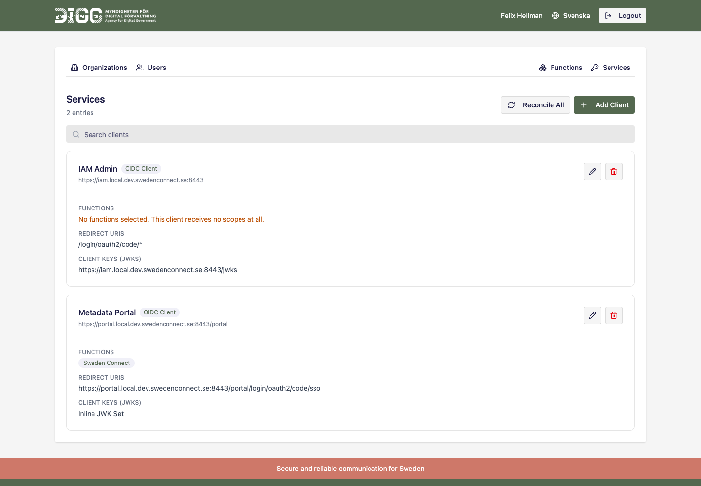
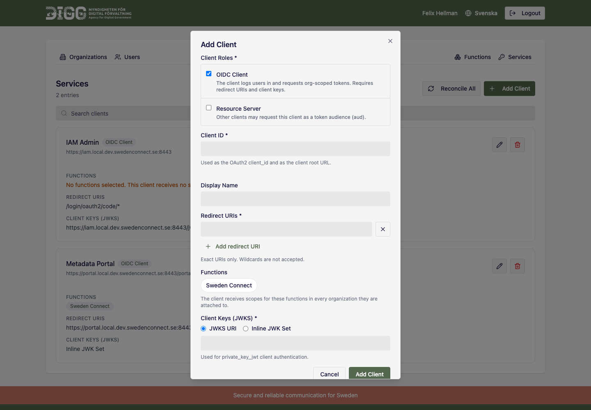
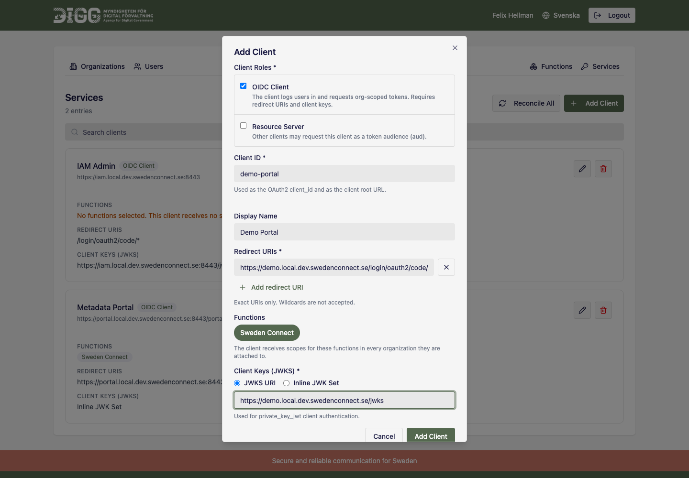
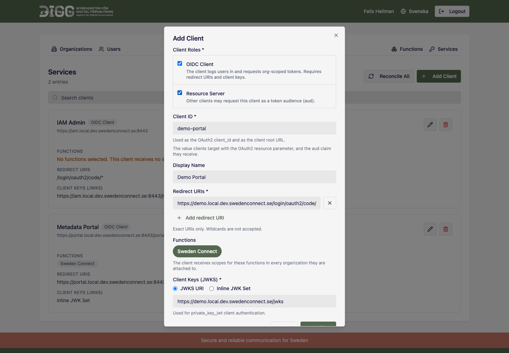
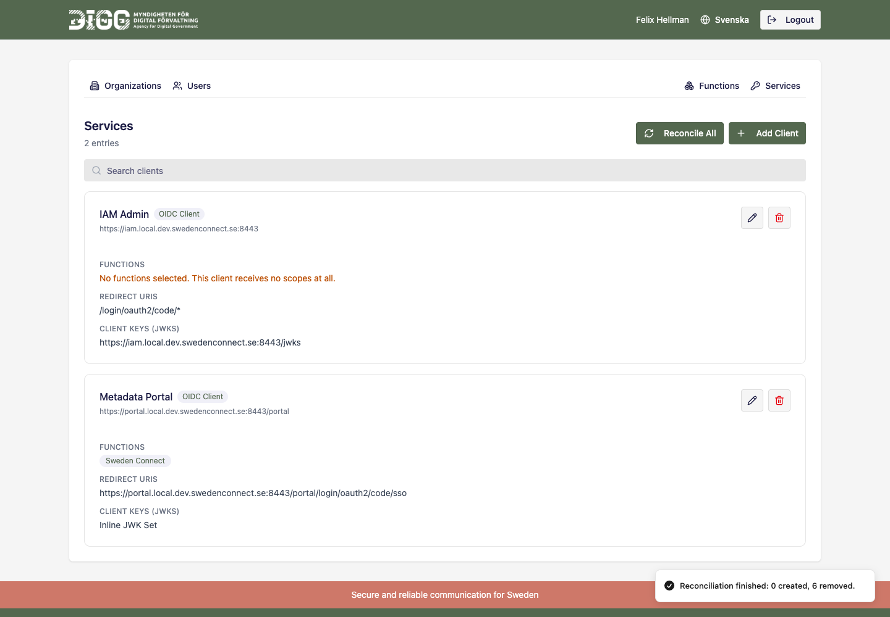

# Registering a Client

---

## Table of Contents

1. [**Overview**](#overview)

2. [**Before You Start**](#before-you-start)

3. [**Route A: The Admin Application**](#route-a-the-admin-application)

   3.1. [Open the Services Tab](#open-the-services-tab)

   3.2. [Choose the Client Roles](#choose-the-client-roles)

   3.3. [Fill In the Client Details](#fill-in-the-client-details)

   3.4. [Clients With Both Roles](#clients-with-both-roles)

   3.5. [Save, and What Happens Next](#save-and-what-happens-next)

   3.6. [Reconciling on Demand](#reconciling-on-demand)

   3.7. [Token Settings](#token-settings)

   3.8. [Service Account Clients](#service-account-clients)

4. [**Route B: The Scripts**](#route-b-the-scripts)

   4.1. [An OIDC Client](#an-oidc-client)

   4.2. [A Resource Server](#a-resource-server)

   4.3. [A Client Registered by Other Means](#a-client-registered-by-other-means)

5. [**Route C: The REST API**](#route-c-the-rest-api)

6. [**Verifying the Result**](#verifying-the-result)

7. [**Troubleshooting**](#troubleshooting)

---

<a name="overview"></a>

## 1. Overview

A client is registered in Keycloak, and, when the IAM admin application maintains its
scopes, policies and permissions, marked as *managed*. This guide covers registering one,
end to end, by either of two equivalent routes: the admin application's GUI, or the shell
scripts under `keycloak/scripts/`. Both produce the same client.

A client plays one or both of two independent **roles**:

| Role | Marker attribute | What it means |
|---|---|---|
| OIDC client | `iam_admin_managed=true` | Logs users in and requests org-scoped tokens. Holds scopes, policies and permissions, and is reconciled. |
| Resource server | `iam_admin_resource_server=true` | May be named in the OAuth2 `resource` parameter and appears in `aud`. Holds no artifacts of its own. |

The conceptual background, what the artifacts are and why reconciliation exists, is in
[Section 2.10 of Keycloak Setup](keycloak-setup.md#managed-clients-and-reconciliation). The rights model behind the `{org}:{function}:{right}` scopes is in the
[Rights Model](rights-model.md).

**Which route to use:**

| Situation | Route |
|---|---|
| Day-to-day registration by an administrator | [Admin application](#route-a-the-admin-application) |
| Bootstrapping a fresh realm, CI, non-interactive provisioning | [Scripts](#route-b-the-scripts) |
| A client that needs a service account, or `org_rights` in only one of the two tokens | [Scripts](#route-b-the-scripts) or the [REST API](#route-c-the-rest-api). The GUI does not expose these |
| Another application driving registration | [REST API](#route-c-the-rest-api) |

---

<a name="before-you-start"></a>

## 2. Before You Start

- The realm is bootstrapped (`bootstrap-realm.sh`), and the Keycloak SPI plugin JARs are
  deployed. See [Keycloak Setup](keycloak-setup.md).
- For the GUI route: you are logged in to the admin application as a **superuser**. Every
  client operation is superuser-only; a non-superuser does not see the **Services** tab at all.
- The functions the client will handle already exist. A function that does not exist is
  rejected with `unknown function: <id>`.
- The client's JWKS endpoint is reachable, or you have its JWK Set at hand. All clients
  authenticate with `private_key_jwt`. There are no client secrets in this system.

---

<a name="route-a-the-admin-application"></a>

## 3. Route A: The Admin Application

<a name="open-the-services-tab"></a>

### 3.1. Open the Services Tab

Log in as a superuser and open the **Services** tab. It lists everything the application
administers, OIDC clients and resource servers alike, each with its roles, functions,
redirect URIs and client keys.



A client showing *No functions selected* holds no scopes, policies or permissions at all,
and no user can obtain an org-scoped token from it. That is a valid state for a client that
has just been registered, but not a working one, see [Troubleshooting](#troubleshooting).

<a name="choose-the-client-roles"></a>

### 3.2. Choose the Client Roles

Select **Add Client**. The first thing the form asks for is the roles, because they decide
which of the remaining fields apply.



- **OIDC Client**: the client logs users in and requests org-scoped tokens. Requires
  redirect URIs and client keys. This is the role that makes a client *managed*.
- **Resource Server**: other clients may name this client in the OAuth2 `resource`
  parameter. It needs no settings of its own.

At least one role is required.

<a name="fill-in-the-client-details"></a>

### 3.3. Fill In the Client Details



| Field | Rules |
|---|---|
| **Client ID** | Required. Used as the OAuth2 `client_id`, typically the application's base URL. No whitespace. Cannot be changed after creation. |
| **Display Name** | Optional. Shown in the Keycloak admin console and in the client list. |
| **Redirect URIs** | Required for the OIDC client role. Absolute URIs. A `*` is accepted only as the **last character**, for example `https://app.example.com/login/oauth2/code/*`. Use **Add redirect URI** for more than one. |
| **Functions** | Optional. The complete list of functions this client receives artifacts for. Selecting none means *none*, never *all*. |
| **Client Keys (JWKS)** | Required for the OIDC client role. Either a **JWKS URI** (absolute, `https://`) or an **Inline JWK Set**, exactly one of the two. |

> **Relative redirect URIs are shown complete.** Keycloak allows a redirect URI given as a path
> and resolves it against the client's root URL. Where a client has a root URL, the application
> shows and saves the two joined, so a client registered by script with a path shows the full
> callback. Where a client has no root URL, the path is shown unchanged and must be completed
> before the client can be saved.

**About Functions:** the selected functions become the client's `client_functions`
attribute. The client is then given scopes, policies and permissions for every organization
that has one of those functions attached, and, on the next reconciliation, loses the ones
for every function it does *not* declare.

<a name="clients-with-both-roles"></a>

### 3.4. Clients With Both Roles

A service that answers requests *and* calls another service onwards carries both roles.
Tick both; the form then shows what the client ID means in each capacity.



The client takes the OIDC client shape, confidential, `client-jwt`, standard flow, Authorization Services, and carries
both marker attributes.

<a name="save-and-what-happens-next"></a>

### 3.5. Save

**Add Client** creates the client in Keycloak with the protocol mappers and base optional
scopes, and, when it holds the OIDC client role, immediately reconciles it: the realm
client scopes, authz scopes, `policy-{org}-{func}-{level}` policies,
`permission-{org}-{func}-{level}` permissions and the optional client scope bindings are
created for every organization that has one of the client's functions attached.

Editing a client reconciles it again, so artifacts for newly selected functions appear at
once.

<a name="reconciling-on-demand"></a>

### 3.6. Reconciling on Demand

**Reconcile All** runs reconciliation over every managed client and reports what it did.



Use it after editing organizations or functions directly in the Keycloak admin console, or
after a partial failure. It is idempotent: a run that finds nothing changes nothing.

> **Reconciliation also deletes.** It removes the scopes a client holds that are not defined
> by a function group for that client, so attach the function groups before reconciling.
> Reconciliation does not run in the background unless
> `iam.admin.client-reconciliation.enabled` is set.

<a name="token-settings"></a>

### 3.7. Token Settings

The **Token Settings** block appears for a client holding the OIDC client role, and carries
the two `org_rights` switches the scripts and the API also expose:

- **`org_rights` in the ID token**: on by default. Off writes
  `id.token.claim=false` on the client's `org-rights-mapper`. Script:
  `--no-org-rights-id-token`. API: `"orgRightsIdToken": false`.
- **`org_rights` in the access token**: on by default, and `access.token.claim` on the
  same mapper. Script: `--no-org-rights-access-token`. API:
  `"orgRightsAccessToken": false`.

Both show the client's current state when it is opened for editing, and are written back on
every save, so a client registered by script keeps what the script gave it until the
setting is changed in the form.

<a name="service-account-clients"></a>

### 3.8. Service Account Clients

A service account is what gives a client Keycloak Admin API access, and the IAM admin
application's own client needs one. **Only the scripts create one**: `add-oidc-client.sh
--service-account`, which keeps the service account user and assigns it the
`realm-management` roles (`manage-users`, `query-groups`, `view-users`, `query-users`,
`manage-realm`, `view-clients`, `manage-clients`). Neither the form nor
`POST /api/clients` can create or attach one.

The application does report it. A client holding a service account carries a **Service
account** pill in the client list:

- **It cannot be deleted from the GUI.** The delete button is disabled, and
  `DELETE /api/clients/{uuid}` answers `409` for such a client, since deleting it would take away
  the very access the application runs on. Remove it in the Keycloak admin console if it
  really has to go.
- **Editing leaves it alone.** Redirect URIs, functions, keys and the `org_rights` switches
  are saved as usual; the service account is neither created nor removed by a save.

The choice is recorded in the `iam_admin_service_account` client attribute. Neither
`serviceAccountsEnabled` nor the presence of a service account user can be read as the answer:
Keycloak turns the flag on and creates the user by itself for **every** client with
Authorization Services enabled, which is every managed OIDC client. A client registered before
the attribute existed is therefore settled by its service account user's role mappings: a
service account that was actually asked for carries the `realm-management` roles the script
assigns, and an auto-created one carries none. The first save through the GUI writes the
attribute, after which no lookup is needed.

---

<a name="route-b-the-scripts"></a>

## 4. Route B: Using Scripts

Full option reference: [Keycloak Admin Scripts](../keycloak/scripts/README.md). Every
script takes `--url`, `--realm`, `--username` and `--password`; they are omitted below for
brevity only where the example already shows them.

<a name="an-oidc-client"></a>

### 4.1. An OIDC Client

`add-oidc-client.sh` registers the client *and* sets `iam_admin_managed=true`, so no
follow-up marking step is needed.

**Step 1. Register the client:**

```bash
./keycloak/scripts/add-oidc-client.sh \
    --url https://keycloak.example.com \
    --realm orgiam \
    --username admin \
    --password keycloak \
    --client-id https://my-app.example.com \
    --name "My App" \
    --redirect-uri 'https://my-app.example.com/login/oauth2/code/*'
```

A redirect URI given as a complete URI needs no root URL, and the script writes none: a
root URL already on the client stays as it is. Give the redirect URI as a path instead and
Keycloak resolves it against the client's root URL, so the script asks for that root URL,
offering the client ID as the default. Pass `--root-url` to answer it up front, which is
what a non-interactive run needs:

```bash
./keycloak/scripts/add-oidc-client.sh \
    ... \
    --redirect-uri '/login/oauth2/code/*' \
    --root-url https://my-app.example.com
```

**Step 2. Declare the functions it handles:**

```bash
./keycloak/scripts/set-client-functions.sh \
    --url https://keycloak.example.com \
    --realm orgiam \
    --username admin \
    --password keycloak \
    --client-id https://my-app.example.com \
    --functions demo
```

**Step 3. Create the artifacts.** The scripts do not create scopes, policies or
permissions; the admin application does. Trigger a run from the **Services** tab, or:

```bash
curl -X POST https://iam.example.com/api/clients/reconcile
```

(The endpoint uses the caller's admin-application session, see
[Route C](#route-c-the-rest-api).)

<a name="a-resource-server"></a>

### 4.2. A Resource Server

A passive API that only validates Bearer tokens:

```bash
./keycloak/scripts/add-resource-server.sh \
    --url https://keycloak.example.com \
    --realm orgiam \
    --username admin \
    --password keycloak \
    --client-id https://api.example.com \
    --functions demo
```

The client is created with all flows disabled, no client authentication, no service
account and no protocol mappers. Its `client_functions` is what the `resource-aud-plugin`
validates the requested `resource` against. It is not a list of artifacts to create, and
a resource server is never reconciled.

<a name="a-client-registered-by-other-means"></a>

### 4.3. A Client Registered by Other Means

A client that already exists in Keycloak, registered by hand or by another tool, becomes
managed by setting the marker:

```bash
./keycloak/scripts/set-iam-admin-managed.sh \
    --url https://keycloak.example.com \
    --realm orgiam \
    --username admin \
    --password keycloak \
    --client-id https://my-app.example.com
```

It then appears in the **Services** tab, and is reconciled from that point on. Clients
registered before these attributes existed are invisible to the application until the
marker is set.

---

<a name="route-c-the-rest-api"></a>

## 5. Route C: The REST API

All endpoints require an authenticated **superuser session** in the admin application and
answer `403` otherwise. Per-client endpoints address the client by its Keycloak **UUID**,
not by its `client_id`. A `client_id` is a URL, and a URL-encoded one in a path segment is
rejected by the HTTP firewall before it reaches the controller.

| Method | Path | Purpose |
|---|---|---|
| `GET` | `/api/clients` | List everything administered: managed clients and resource servers |
| `GET` | `/api/clients/{uuid}` | Read one client |
| `POST` | `/api/clients` | Register a client: `201`, `400` on invalid input, `409` if the `client_id` is taken |
| `PUT` | `/api/clients/{uuid}` | Update a client, then reconcile it |
| `DELETE` | `/api/clients/{uuid}` | Delete the client and its artifacts |
| `POST` | `/api/clients/{uuid}/reconcile` | Reconcile one client |
| `POST` | `/api/clients/reconcile` | Reconcile every managed client |

**Request body** (`POST /api/clients`):

```json
{
  "clientId": "https://my-app.example.com",
  "name": "My App",
  "oidcClient": true,
  "resourceServer": false,
  "redirectUris": ["https://my-app.example.com/login/oauth2/code/iam"],
  "functions": ["demo"],
  "jwksUri": "https://my-app.example.com/jwks",
  "orgRightsIdToken": true,
  "orgRightsAccessToken": true
}
```

`oidcClient` defaults to `true`, `orgRightsIdToken` and `orgRightsAccessToken` default to
`true`, and every other flag defaults to `false`. `PUT /api/clients/{uuid}` takes the same
two `org_rights` flags, but omitting one there keeps the client's current value rather than
applying the create default. Neither endpoint takes a service account: registering one is
[script-only](#service-account-clients), and `DELETE` refuses a client that holds one with
a `409`. Supply `jwksString` instead of `jwksUri`
for an inline JWK Set; exactly one of the two is required for an OIDC client.

The validation rules are the ones the [form](#fill-in-the-client-details) enforces, applied
server-side as well: at least one role, no whitespace in `clientId`, at least one absolute
redirect URI for an OIDC client with any `*` as its last character, an `https://` `jwksUri`, and
functions that exist in the realm.

---

<a name="verifying-the-result"></a>

## 6. Verifying the Result

After registration and a reconciliation run, a managed client handling function `demo`,
with `demo` attached to organization `2021006883`, holds:

| Artifact | Name | Where |
|---|---|---|
| Realm client scope | `2021006883:demo:read` (and `:write`, `:admin`) | Realm, shared between clients |
| Authz scope | `2021006883:demo:read` (and the other two) | The client's Authorization Services |
| Group policy | `policy-2021006883-demo-read` (and the other two) | The client's Authorization Services |
| Scope permission | `permission-2021006883-demo-read` (and the other two) | The client's Authorization Services |
| Optional client scope | `2021006883:demo:read` (and the other two) | Bound to the client |

Nine artifacts per organization and function. In the Keycloak admin console they are under
**Clients → your client → Authorization → Policies / Permissions / Scopes**, and under
**Client scopes** for the realm-level ones.

The **Services** tab shows the client's functions, redirect URIs and client keys; a
reconciliation run that reports `0 created` against a client you expect artifacts for means
they already exist.

---

<a name="troubleshooting"></a>

## 7. Troubleshooting

**The client shows *No functions selected*.**
Its `client_functions` is empty, so it holds nothing and no user can obtain an org-scoped
token from it. Edit the client and select its functions. The application logs a warning
naming every such client on each reconciliation run.

**Users hold rights but get no scopes.**
The client was probably registered *after* the functions were attached to the
organizations, so its artifacts were never created. Run **Reconcile All**. This is the
case reconciliation exists for.

**Artifacts disappeared after a reconciliation run.**
Reconciliation removes the scopes a client holds that are not defined by a function group
for that client. Attach the function groups, then reconcile again.

**A redirect URI is rejected.**
The GUI and the API accept absolute URIs, with a `*` allowed only as the last character. A `*` in
the scheme, the host or the middle of the path is refused, because Keycloak would never match it.
A redirect URI stored as a bare path is also refused unless the client has a root URL to expand it
against; complete it by hand in that case.

**`unknown function: <id>`.**
The function does not exist in the realm. Create it under the **Functions** tab first.

**The Services tab is not visible.**
It is superuser-only. Check the account's `org_rights` claim; see the
[Rights Model](rights-model.md#the-org_rights-claim).

**A client registered outside the application does not appear.**
It is missing `iam_admin_managed=true` (OIDC client) or `iam_admin_resource_server=true`
(resource server). Set the marker with `set-iam-admin-managed.sh`, or re-run
`add-resource-server.sh` against it.

---

Copyright &copy; 2026, [Myndigheten för digital förvaltning - Swedish Agency for
Digital Government (DIGG)](https://www.digg.se). Licensed under version 2.0 of the
[Apache License](https://www.apache.org/licenses/LICENSE-2.0).
